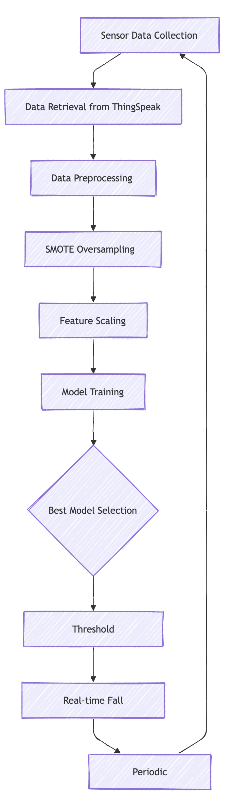
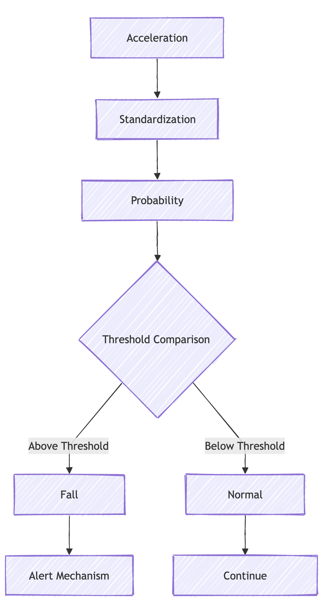

# 🚨 Automatic Personalized Threshold (APT) - an Intelligent Fall Detection Machine Learning System

## 📊 System Overview

This project implements an advanced machine learning-based fall detection system using sensor acceleration data. The system features our novel Automatic Personalized Threshold (APT) model, which continuously monitors and analyzes acceleration measurements to identify potential fall events in real-time.

### Key Features

- Automatic Personalized Threshold (APT) machine learning approach
- Dynamic threshold optimization
- Handling of class-imbalanced datasets
- Real-time data processing
- Automatic model retraining and threshold adjustment

## 🔬 Machine Learning Models Comparison

### Model Performance Comparison

| Model Type       | Complexity  | Fall Detection Capability | Key Strengths                              |
| ---------------- | ----------- | ------------------------- | ------------------------------------------ |
| 🤖 APT           | Medium-High | ★★★★★                     | Personalized thresholds, adaptive learning |
| 🌳 Random Forest | Medium      | ★★★★☆                     | Ensemble learning, robust classification   |
| 📊 SVM           | High        | ★★★★                      | Complex decision boundaries                |
| 🎄 Decision Tree | Low         | ★★★                       | Simple interpretability                    |

## 🧠 APT Model Training and Evaluation

### Performance Metrics

| Metric    | Description                                     | Importance                      |
| --------- | ----------------------------------------------- | ------------------------------- |
| Precision | Proportion of true fall detections              | Minimizes false positives       |
| Recall    | Proportion of actual falls correctly identified | Catches most fall events        |
| F1 Score  | Harmonic mean of precision and recall           | Balanced performance measure    |
| APT Score | Personalization accuracy metric                 | Measures threshold optimization |

## 🔍 Fall Detection Decision Process

### APT Threshold Characteristics

| Threshold Characteristic | Description                        |
| ------------------------ | ---------------------------------- |
| Optimization Method      | APT-based dynamic thresholding     |
| Adaptation               | Real-time personalization          |
| Learning Rate            | Adaptive based on user patterns    |
| Goal                     | Optimize personal threshold values |

## 🛠 System Requirements

### Software Dependencies

- Python 3.8+
- Key Libraries:
  - scikit-learn
  - pandas
  - numpy
  - requests
  - imbalanced-learn
  - apt-core (custom APT implementation)

### Hardware Requirements

- Sensor with acceleration data
- Stable internet connection
- Computing device with:
  - Minimum 8GB RAM
  - Multi-core processor
  - Reliable storage

## 📈 Key Technical Innovations

### APT Implementation

- **Dynamic Thresholding**: Automatically adjusts to user patterns
- **Personalization Engine**: Learns from individual user data
- **Adaptive Learning**: Continuously updates threshold values
- **Pattern Recognition**: Identifies user-specific movement patterns

### Imbalanced Data Handling

- **SMOTE**: Generates synthetic minority class samples
- **Random Undersampling**: Reduces majority class samples
- **Adaptive Class Weighting**: Adjusts model sensitivity

## 🔮 Future Development Roadmap

1. Enhanced APT algorithm optimization
2. Deep learning model integration
3. Multi-sensor fusion techniques
4. Edge computing deployment
5. Enhanced real-time visualization
6. Improved model interpretability

## ⚠️ Limitations and Considerations

- Initial calibration period required for APT
- Sensor quality dependent
- Environment-specific performance variations
- Requires periodic model retraining
- Potential for false positives/negatives

## 🤝 Ethical Framework

- Strict user privacy protection
- Informed consent protocols
- Robust data security measures
- Continuous model performance validation
- Transparent APT decision-making

---

## 📜 Disclaimer

**Research-Grade System**: This fall detection system, featuring the Automatic Personalized Threshold (APT) model, is a research prototype. It should always be complemented with professional medical advice and traditional safety measures.
