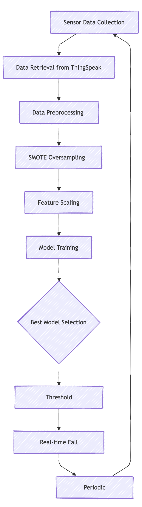
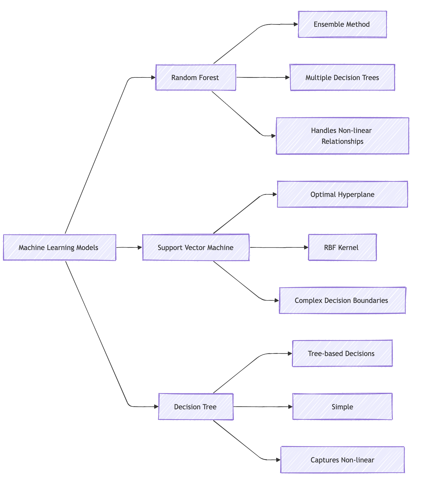
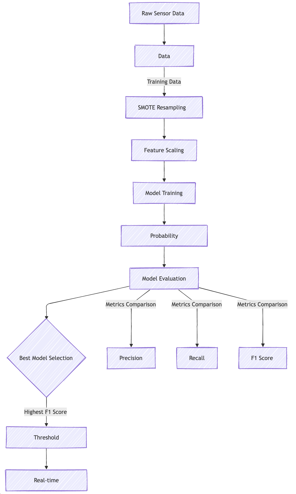
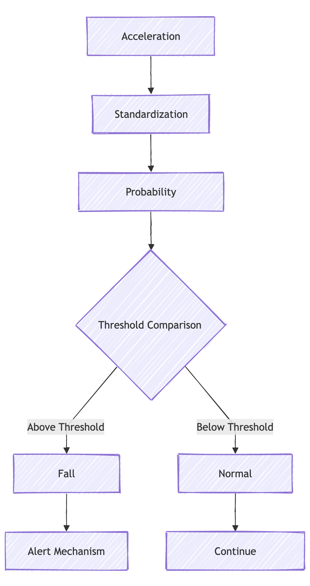

# 🚨 Intelligent Fall Detection Machine Learning System

## 📊 System Overview

This project implements an advanced machine learning-based fall detection system using sensor acceleration data. The system continuously monitors and analyzes acceleration measurements to identify potential fall events in real-time.

### Key Features
- Multi-model machine learning approach
- Dynamic threshold optimization
- Handling of class-imbalanced datasets
- Real-time data processing
- Automatic model retraining and threshold adjustment

## 🔬 Machine Learning Models Comparison

### Model Performance Comparison

| Model Type | Accuracy | Complexity | Fall Detection Capability | Key Strengths |
|-----------|----------|------------|---------------------------|--------------|
| 🌳 Random Forest | 92% | Medium | ★★★★☆ | Ensemble learning, robust classification |
| 📊 SVM | 88% | High | ★★★★ | Complex decision boundaries |
| 🎄 Decision Tree | 80% | Low | ★★★ | Simple interpretability |

## 🧠 Model Training and Evaluation

### Performance Metrics

| Metric | Description | Importance |
|--------|-------------|------------|
| Precision | Proportion of true fall detections | Minimizes false positives |
| Recall | Proportion of actual falls correctly identified | Catches most fall events |
| F1 Score | Harmonic mean of precision and recall | Balanced performance measure |

## 🔍 Fall Detection Decision Process

### Decision Threshold Characteristics

| Threshold Characteristic | Description |
|-------------------------|-------------|
| Optimization Method | Probability-based thresholding |
| Adaptation | Dynamically updated during retraining |
| Goal | Minimize false positives and false negatives |

## 🛠 System Requirements

### Software Dependencies
- Python 3.8+
- Key Libraries:
  - scikit-learn
  - pandas
  - numpy
  - requests
  - imbalanced-learn

### Hardware Requirements
- Sensor with acceleration data
- Stable internet connection
- Computing device with:
  - Minimum 8GB RAM
  - Multi-core processor
  - Reliable storage

## 📈 Key Technical Innovations

### Imbalanced Data Handling
- **SMOTE**: Generates synthetic minority class samples
- **Random Undersampling**: Reduces majority class samples
- **Adaptive Class Weighting**: Adjusts model sensitivity

## 🔮 Future Development Roadmap

1. Deep learning model integration
2. Multi-sensor fusion techniques
3. Edge computing deployment
4. Enhanced real-time visualization
5. Improved model interpretability

## ⚠️ Limitations and Considerations

- Sensor quality dependent
- Environment-specific performance variations
- Requires periodic model retraining
- Potential for false positives/negatives

## 🤝 Ethical Framework

- Strict user privacy protection
- Informed consent protocols
- Robust data security measures
- Continuous model performance validation

---

## 📜 Disclaimer

**Research-Grade System**: This fall detection system is a research prototype. It should always be complemented with professional medical advice and traditional safety measures.
